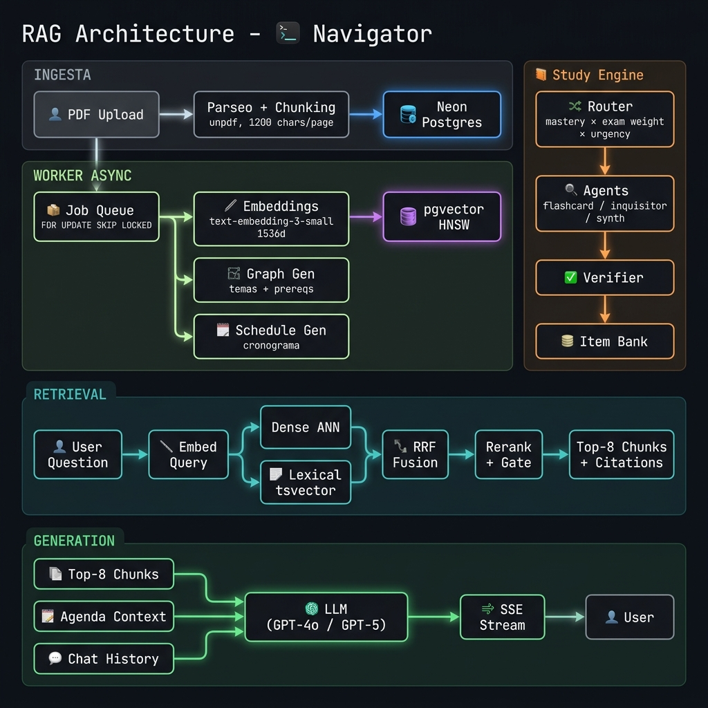

<p align="center">
  
</p>

<h1 align="center">Navigator</h1>

<p align="center">
  <strong>Academic AI assistant — upload your syllabus, ask anything, study with generated material.</strong>
</p>

<p align="center">
  
  
  
  
  
  
</p>

<p align="center">
  <a href="#-the-problem">Problem</a> ·
  <a href="#-the-solution">Solution</a> ·
  <a href="#-features">Features</a> ·
  <a href="#-architecture">Architecture</a> ·
  <a href="#-rag-pipeline">RAG Pipeline</a> ·
  <a href="#-tech-stack">Stack</a> ·
  <a href="#-getting-started">Getting Started</a> ·
  <a href="#-environment-variables">Env Vars</a>
</p>

---

## 🎯 The Problem

Students receive syllabi as PDFs and lose them in a folder. When exams arrive, they don't know which topics are prerequisites for others, which assessment comes first, or have personalized practice material. The information is there — but **it is not accessible, not interactive, and doesn't adapt to what each student needs to review.**

## 🚀 The Solution

**Navigator** transforms any academic syllabus into a **complete learning system**:

1. **Upload your PDF** — Navigator parses it, chunks it, and generates vector embeddings.
2. **Ask the chat** — Answers grounded in the real syllabus content, with exact citations. No hallucinations.
3. **Visualize the knowledge map** — An editable graph of topics and prerequisites, generated automatically.
4. **Study with adaptive material** — Flashcards, quizzes, summaries, and mind maps generated from your material, with configurable difficulty and anti-repetition.
5. **Check your agenda** — Evaluations, weekly topics, and review recommendations crossing all your courses.

> A single app. A single deploy. Zero additional infrastructure.

---

## ✨ Features

| Feature | Description |
|---|---|
| **RAG Chat** | Questions about the syllabus with grounded answers and real PDF citations. Schedule-aware: knows which evaluations you have this week. Streaming via SSE. |
| **Knowledge Graph** | AI-generated topic and prerequisite graph. Fully editable: add, rename, connect, and save nodes. Cycle-validated (DFS). |
| **Study Area** | 6 modes: flashcards (3D flip), dynamic quiz, simulation, review mode, mind map, and automatic summary. Choose difficulty and topic. |
| **Smart Agenda** | Monthly calendar with events detected from the schedule. Per-day notes. Recommendations of what to review based on prerequisites. |
| **Multi-course** | The chat searches all your courses. The agenda crosses evaluations. The study area focuses on your weakest topics. |
| **Guest Access** | Use the app without an account: the PDF is processed and auto-deleted in 24h. Upon registration, data becomes permanent. |
| **SSE Streaming** | Real-time chat answers. Final event carries `title`, `citations`, `provider`, and `model`. |

---

## 🏗 Architecture

> Everything lives in a **single full-stack Next.js app** deployed to Vercel. No separate backend, no Python, no Docker in production. The entire RAG pipeline (ingestion, embeddings, retrieval, generation) is implemented in TypeScript and runs as Next.js API routes.

### Request Flow

```
Client (React)
  └─► src/lib/api.ts                    ← Single client→server adapter (all fetch calls go here)
        └─► app/api/**/route.ts          ← HTTP handler: auth, validate, call service, shape response
              └─► lib/server/services/   ← Business logic (RAG, chat, documents)
                    └─► lib/server/repositories/  ← All SQL (Neon) lives here
                          └─► lib/db.ts  ← Neon serverless client (sql tagged template)
```

### Ingestion Flow (2-Phase Async)

```
POST /api/upload  (responds immediately)
  │
  ├─ Phase 1 (sync):   PDF → magic bytes validation → SHA-256 hash
  │                         → unpdf text extraction → chunking (1200 chars / 120 overlap)
  │                         → store text chunks in Neon (no embeddings yet)
  │                         → enqueue job → return to client
  │
  └─ Phase 2 (async worker via cron/process):
       chunks → batch embeddings (text-embedding-3-small, 1536d) → pgvector HNSW
       → structured output: Knowledge Graph (topic nodes + edges, DFS cycle validation)
       → structured output: Schedule extraction (evaluations, weekly topics)
       → multi-agent: Study content generation (flashcards, quiz, summary, mind map)
```

### Retrieval Flow (RAG Query)

```
User question
  → embed query (text-embedding-3-small)
  → pgvector cosine similarity (dense, <=>)  ┐
  → tsvector GIN fulltext search (lexical)   ├─ hybrid RRF merge → over-fetch K=24
  → relevance gate (cosine > 0.9 → no ctx)  ┘
  → rerank vectorial + lexical → top-8 chunks with citations (page / offset)
  → GROUNDED_SYSTEM_PROMPT + agenda block (all courses) + 6-turn history
  → LLM (GPT-4o-mini / OpenRouter fallback) → SSE stream
  → final event: { title, citations, provider, model }
```

---

## 🔬 RAG Pipeline — Layer by Layer

| Layer | What it does |
|---|---|
| **Ingestion (sync)** | PDF parsing (`unpdf`), chunking by page (1200 chars / 120 overlap), magic bytes validation, SHA-256 hash. Stores text in Neon without embeddings yet. |
| **Async Worker** | Reads pending chunks → batch embeddings (`text-embedding-3-small`, 1536d) → pgvector HNSW. Then: generates topic graph (structured output + DFS cycle validation) and evaluation schedule. |
| **Multi-index** | Dense (pgvector `<=>`) + hybrid lexical (`tsvector` GIN + RRF) for topic-based retrieval. Covers the full syllabus, not just the first 24k chars. |
| **Retrieval** | Over-fetch K=24 candidates → relevance gate (cosine > 0.9 → no context injected) → vector + lexical rerank → top-8 chunks with citations (page / offset). |
| **Study Agents** | Adaptive router (exam weight × domain × schedule urgency) → TS graph orchestrator → specialized agents (flashcard, inquisitor, synth) → different-family verifier → item bank with embedding-based dedup. |
| **Chat Generation** | RAG context + agenda block (all courses) + 6-turn history → `GROUNDED_SYSTEM_PROMPT` (student mentor persona) → `chatStream` SSE. Final event: `title`, `citations`, `provider`, `model`. |
| **Job Queue** | Atomic claim (`FOR UPDATE SKIP LOCKED`), exponential backoff `2^attempts`, stuck-job rescue (> 10 min), fire-and-forget on upload + backup cron. |

---

## 🏛 Tech Stack

| Layer | Technology |
|---|---|
| **Framework** | Next.js 14 (App Router), React 18, TypeScript strict |
| **Database** | Neon serverless Postgres + pgvector (embeddings 1536d, HNSW index) |
| **Auth** | NextAuth v5, bcryptjs, RBAC roles (`guest → free → pro → admin`) |
| **LLM** | OpenAI SDK + OpenRouter (fallback by tier). GPT-4o-mini default. |
| **Graph UI** | `@xyflow/react` (editable: add / rename / delete / connect nodes) |
| **UI** | Tailwind CSS 4, shadcn/ui (`@base-ui` / Radix), Lucide icons, Sonner toasts |
| **Validation** | Zod (server) + react-hook-form (client) |
| **PDF** | `unpdf` (in-process text extraction, no native deps) |
| **Cache / Rate limit** | Upstash Redis (optional; in-memory fallback per instance) |
| **Markdown / Math** | `react-markdown`, `remark-gfm`, `remark-math`, `rehype-katex` |
| **Blob storage** | Vercel Blob (account PDFs; degrades with warning if token absent) |
| **CI** | GitHub Actions (typecheck + 197 Vitest tests) |
| **Deploy** | Vercel (single app, root dir: `syllabus-navigator/frontend`) |

---

## 🚀 Getting Started

### Prerequisites

- Node.js 18+
- [Neon](https://neon.tech) Postgres database with pgvector extension
- OpenAI API key

### Installation

```bash
# Clone and navigate to the app
git clone <repo-url>
cd syllabus-navigator/frontend

# Install dependencies
npm install

# Copy and fill environment variables
cp .env.example .env.local

# Apply database schema (idempotent — safe to re-run)
npm run db:migrate

# Start dev server
npm run dev
```

The app will be available at `http://localhost:3000`.

### Useful Commands

```bash
npm run dev          # Dev server on :3000
npm run build        # Production build
npm run db:migrate   # Apply schema.sql to Neon (idempotent)
npm run db:users     # List users (debug)
npm test             # Vitest (197 tests; mocks auth + DB, no live services)
npm run lint         # ESLint (next/core-web-vitals)
npm run format       # Prettier --write
npm run knip         # Report unused files / exports / deps
```

---

## 🔐 Environment Variables

| Variable | Required | Description |
|---|---|---|
| `AUTH_SECRET` | ✅ | Generate with `npx auth secret` |
| `NEXTAUTH_URL` | ✅ | e.g. `http://localhost:3000` |
| `DATABASE_URL` | ✅ | Neon pooled connection (runtime) |
| `DATABASE_URL_DIRECT` | ✅ | Neon direct connection (migrations) |
| `OPENAI_API_KEY` | ✅ | Default LLM provider |
| `OPENROUTER_API_KEY` | ☑️ | Fallback / extended models |
| `CRON_SECRET` | ☑️ prod | Gates `/api/cron/*`; arms fire-and-forget ingest worker |
| `BLOB_READ_WRITE_TOKEN` | ☑️ | Vercel Blob; account PDFs degrade with warning if absent |
| `GOOGLE_CLIENT_ID` / `_SECRET` | ☑️ | Google OAuth sign-in (NextAuth provider) |
| `DEFAULT_LLM_PROVIDER` / `_MODEL` | — | Defaults: `openai` / `gpt-4o-mini` |
| `RAG_MAX_DISTANCE` | — | Cosine cutoff for retrieval relevance gate (default `0.9`) |
| `RATE_LIMIT_ENABLED`, `LOG_LEVEL` | — | Ops toggles |
| `UPSTASH_REDIS_REST_URL` / `_TOKEN` | — | Omit → in-memory cache + rate-limit (resets on cold start) |

---

## 🗄 Database Schema

The schema is defined in `src/lib/schema.sql` and applied with `npm run db:migrate`. Key tables:

```
users                 user_preferences      syllabus_uploads
chunks                programs              courses
syllabi               topics                topic_dependencies
schedule_events       chats                 messages
usage_records         feedback              jobs
study_sets            date_notes            flashcard_reviews
```

pgvector is enabled via `CREATE EXTENSION vector`. The `chunks.embedding` column is `vector(1536)` with an HNSW index on cosine ops. All schema changes use `IF NOT EXISTS` / `ALTER ... ADD COLUMN IF NOT EXISTS` for safe re-runs.

---

## 📁 Project Structure

```
syllabus-navigator/frontend/
├── app/                        # Next.js App Router
│   ├── api/                    # API routes (chat, upload, graph, study, schedule…)
│   └── (pages)/                # /, /knowledge, /agenda, /estudio, /mapa, /settings
├── src/
│   ├── lib/
│   │   ├── api.ts              # Single client→server adapter (all fetch calls)
│   │   ├── db.ts               # Neon serverless client
│   │   ├── server/
│   │   │   ├── services/       # Business logic (RAG, chat, documents)
│   │   │   ├── repositories/   # All SQL queries
│   │   │   ├── rag/            # chunking, graph-gen, schedule-gen, study-gen
│   │   │   ├── storage/        # Vercel Blob adapter
│   │   │   └── validators/     # Zod schemas (API input)
│   │   ├── llm/                # selectModel, chatCompletion, chatStream; OpenAI + OpenRouter
│   │   ├── cache/              # L1 in-memory + L2 Upstash
│   │   ├── auth/               # NextAuth config, RBAC
│   │   ├── prompts/            # getPrompt(), GROUNDED_SYSTEM_PROMPT
│   │   ├── guardrails/         # validateInput / validateOutput
│   │   ├── metering/           # recordUsage → usage_records
│   │   └── observability/      # logger, timing (timed), trace
│   ├── components/
│   │   ├── ui/                 # shadcn-style primitives (Radix/base-ui)
│   │   ├── navigator/          # App shell: sidebar, header, chat thread, composer
│   │   └── (feature dirs)/     # agenda/, estudio/, auth/, GraphCanvas…
│   ├── features/chat/          # ChatContext, useChatWorkspace, chat hooks
│   ├── context/                # UserContext, AuthModalContext, SyllabusContext
│   └── types/                  # api.ts (DTOs), models.ts
└── scripts/                    # migrate.mjs, seed-user.mjs, list-users.mjs
```

---

## 📡 API Surface

| Route | Method | Description |
|---|---|---|
| `/api/upload` | POST | Upload PDF (guests allowed; sync phase only) |
| `/api/upload/list` | GET | List user's uploaded syllabi |
| `/api/upload/[id]` | PATCH / DELETE | Rename or delete a syllabus |
| `/api/chat/history` | GET / POST | List & create chats |
| `/api/chat/[chatId]` | GET / PATCH / DELETE | Chat detail, rename, set model/syllabus, delete |
| `/api/chat/[chatId]/messages` | POST | Send message → **SSE stream** |
| `/api/chat/models` | GET | Available models for the user's tier |
| `/api/graph/[syllabusId]` | GET / PATCH | Read graph, save edited mind map |
| `/api/graph/[syllabusId]/reprocess` | POST | Re-enqueue ingest pipeline |
| `/api/schedule` | GET | Cronograma (all courses or `?syllabusId=`) |
| `/api/recommendations` | GET | Weekly plan: assessments + topics + review hints |
| `/api/study/[syllabusId]` | GET | Study material (`?refresh&difficulty&topic`) |
| `/api/study/review` | POST | Record flashcard review |
| `/api/study/stats` | GET | Streak / card stats |
| `/api/notes` | GET / POST | Per-date agenda notes |
| `/api/notes/[id]` | PATCH / DELETE | Edit / delete a note |
| `/api/auth/signup` | POST | Account creation |
| `/api/auth/upgrade` | POST | Guest → registered user upgrade |
| `/api/cron/process` | POST | Drain ingest worker (requires `CRON_SECRET`) |
| `/api/cron/cleanup` | POST | Scheduled guest data cleanup |
| `/api/health` | GET | Health check |

---

<p align="center">
  <sub>Built with Next.js, OpenAI, pgvector, and many late-night coffee sessions. ☕</sub>
</p>
