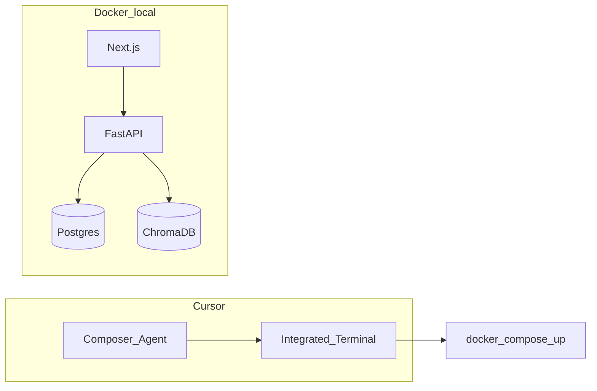

# Guía paso a paso en Cursor — Syllabus Navigator

Esta guía enlaza el **plan de producto en Notion** con **acciones concretas en Cursor** sobre el repositorio `syllabus-navigator`. Úsala como hoja de ruta operativa; el detalle de negocio sigue en Notion.

## Enlaces bidireccionales

| Recurso | URL o ruta |
|---------|------------|
| n1 (idea, arquitectura, backlog conceptual) | [Notion — n1 Syllabus Navigator](https://www.notion.so/355759653ead807c8aa2c9964f36e151) |
| Espejo de esta guía en Notion (hija de n1) | [Notion — Guía paso a paso en Cursor](https://www.notion.so/355759653ead81f7a944ec7baa524ce3) |
| Plan por fases (Notion) | [Notion — Plan](https://www.notion.so/355759653ead806089e9f0cf48335790) |
| Backlog técnico local | [`NEXT_STEPS.md`](../NEXT_STEPS.md) |
| Este playbook (repo) | `c:\Users\Joshua\Desktop\PROYECTO\syllabus-navigator\docs\cursor-playbook.md` |

### Mapa Notion Plan ↔ secciones de este documento

| Notion (Plan) | Sección aquí |
|---------------|----------------|
| Fase 1: Cimientos y Dockerización | [Fase 1 — Cimientos](#fase-1--cimientos-y-stack-local) |
| Fase 2: Pipeline de ingesta | [Fase 2 — Ingesta](#fase-2--ingesta-pdf--chunks--vectores) |
| Fase 3: Motor RAG | [Fase 3 — RAG](#fase-3--motor-rag-y-memoria-por-cuenta) |
| Fase 4: UI/UX | [Fase 4 — UI](#fase-4--frontend-nextjs) |
| Fase 5: Hardening y despliegue | [Fase 5 — Hardening](#fase-5--hardening-y-ops) |

### Modelo de datos MVP (opción A implementada)

Las tablas de grafo del `init.sql` original (`programs` → `courses` → `syllabi` → `topics`) siguen para **Sprint 2**. El MVP RAG usa la tabla **`syllabus_uploads`** (mismo [`docker/postgres/init.sql`](../docker/postgres/init.sql)) para metadatos por `user_id` sin insertar cursos ficticios. Si tu volumen de Postgres se creó antes de esa tabla, recrea el volumen o aplica el DDL de `syllabus_uploads` a mano.

## Arquitectura objetivo (Cursor + local)



## 1. Antes de abrir Cursor

- **Docker Desktop** (Windows): WSL2 backend recomendado; suficiente RAM para Postgres + Chroma + dos contenedores de app.
- **Node 20** y **npm**: el frontend se instala dentro del contenedor, pero tener Node local ayuda para scripts y herramientas opcionales.
- **Python 3.11** (opcional fuera de Docker): útil para ejecutar tests del backend en la máquina host con el mismo `requirements.txt`.
- **Cuenta y claves**: define proveedor LLM/embeddings (por defecto el proyecto asume variables tipo OpenAI en [`.env.example`](../.env.example)). Auth tipo Clerk/Auth0 es **post-MVP** en este scaffold: hasta entonces usa un **`user_id` fijo o header de desarrollo** documentado en código.
- **Nota Chroma y puertos**: en [`docker/docker-compose.yml`](../docker/docker-compose.yml) el servicio `chroma` mapea **8001:8000** (host:contenedor). Desde el contenedor `backend`, el host suele ser `chroma` y el **puerto interno 8000**. Si el cliente HTTP apunta a `chroma:8001` fallará; al implementar el cliente, usa **`CHROMA_HOST=chroma`** y **`CHROMA_PORT=8000`** dentro de la red Docker (ajusta `.env` o `config.py` cuando conectes Chroma de verdad).

## 2. Abrir el proyecto en Cursor

1. En Cursor: **File → Open Folder**.
2. Abre la carpeta **`syllabus-navigator`** (raíz del monorepo), no solo `PROYECTO`.

**Por qué:** Las rutas del README y de `docker compose` son relativas a esa raíz (`../backend`, `../frontend`). Los `@archivo` en el chat resolverán mejor.

## 3. Variables de entorno

1. Copia [`.env.example`](../.env.example) a **`.env`** en la raíz de `syllabus-navigator` (junto a `docker/`).
2. Rellena al menos **`OPENAI_API_KEY`** (o las variables que implementes para otro proveedor).
3. No subas `.env` a git (debe estar en `.gitignore`).

Variables mínimas documentadas en el ejemplo:

- `APP_*`, modelos `EMBEDDING_MODEL`, `CHAT_MODEL`
- `POSTGRES_*` (alineadas con `docker-compose`)
- `CHROMA_HOST`, `CHROMA_PORT`
- `FRONTEND_PORT` si el front lo consume

## 4. Levantar el stack

Desde la raíz `syllabus-navigator` (terminal integrado de Cursor):

```bash
docker compose -f docker/docker-compose.yml up --build
```

**Verificación:**

- API: [http://localhost:8000/docs](http://localhost:8000/docs) (Swagger de FastAPI).
- Health: [http://localhost:8000/health](http://localhost:8000/health).
- Frontend: [http://localhost:3000](http://localhost:3000).

Si algo falla, revisa logs del servicio `backend` (instalación `pip`) y `frontend` (`npm install`).

## 5. Uso de Cursor por fases

En cada fase: objetivo, archivos clave, prueba rápida, **prompt guía** para pegar en el agente (Composer) con contexto `@`.

### Fase 1 — Cimientos y stack local

**Objetivo:** Scaffold estable: FastAPI montando routers, Next corriendo, Postgres y Chroma levantados.

**Archivos clave:**

- [`backend/main.py`](../backend/main.py) — instancia FastAPI y routers.
- [`backend/app/core/config.py`](../backend/app/core/config.py) — settings desde `.env`.
- [`docker/docker-compose.yml`](../docker/docker-compose.yml) — orquestación.
- [`frontend/package.json`](../frontend/package.json) — scripts del front.

**Smoke test:** `GET /health` → `{"status":"ok"}`.

**Prompt guía (ejemplo):**

> Revisa `backend/main.py` y `app/api/*` para listar endpoints existentes. No añadas features; solo confirma que el compose levanta backend y frontend y documenta cualquier variable de entorno faltante en un comentario breve en `README` si hace falta.

---

### Fase 2 — Ingesta (PDF → chunks → vectores)

**Objetivo:** Subir PDF, extraer texto/markdown con buena estructura, trocear por secciones, escribir en Chroma con **metadata `user_id`** (y `file_id` si aplica).

**Archivos clave:**

- [`backend/app/services/ingestor.py`](../backend/app/services/ingestor.py)
- [`backend/app/api/routes_upload.py`](../backend/app/api/routes_upload.py)
- Esquemas: [`backend/app/schemas/syllabus.py`](../backend/app/schemas/syllabus.py)

**Estrategia de parsing:** Marker o Docling dan mejor Markdown; para iterar rápido, **PyMuPDF** o **pdfplumber** como fallback reduce peso de imagen Docker. Si Marker alarga mucho el build, añade un **Dockerfile** dedicado al backend con capas cacheadas para dependencias pesadas.

**Smoke test:** subir un PDF de prueba y verificar chunks persistidos (logs o endpoint de estado si existe).

**Prompt guía (ejemplo):**

> Implementa el pipeline en `ingestor.py`: leer PDF, opcional conversión a markdown, chunking por encabezados. En `routes_upload.py`, asocia cada ingestión a `user_id` (header `X-User-Id` o similar para dev). Escribe en Chroma con `where` filtrable por `user_id` en la fase 3.

---

### Fase 3 — Motor RAG y “memoria por cuenta”

**Objetivo:** Recuperación híbrida (metadatos en Postgres + similitud en Chroma), respuestas **ancladas al documento**, citas tipo `[Fuente: archivo.pdf, pág. N]`.

**Archivos clave:**

- [`backend/app/services/rag_engine.py`](../backend/app/services/rag_engine.py)
- [`backend/app/api/routes_chat.py`](../backend/app/api/routes_chat.py)

**Smoke test:** `POST` al endpoint de chat con una pregunta cuya respuesta exista solo en el PDF subido; comprobar cita y ausencia de datos de otros usuarios (prueba con dos `user_id`).

**Prompt guía (ejemplo):**

> En `rag_engine.py`, implementa consulta a Chroma con filtro de metadatos `user_id`. System prompt: si el contexto recuperado está vacío o no responde la pregunta, devolver mensaje tipo “No consta en tus archivos”. Opcional: SSE en FastAPI para streaming y consumo desde Next.

---

### Fase 4 — Frontend (Next.js)

**Objetivo:** UI de carga de archivos, chat contra el API, lista de materias/archivos.

**Archivos:** bajo `frontend/` (componentes de chat, upload, variables `NEXT_PUBLIC_API_URL` o proxy).

**Smoke test:** flujo manual: subir → preguntar → ver respuesta con cita.

**Prompt guía (ejemplo):**

> Conecta el formulario de upload y el chat a los endpoints reales del backend. Maneja errores de red y estados de carga. Opcional: visor PDF con salto a página al clicar cita.

---

### Fase 5 — Hardening y ops

**Objetivo:** tests de integración upload→query, validación de grafos/prerrequisitos, CI verde.

**Archivos clave:**

- [`backend/app/services/graph_gen.py`](../backend/app/services/graph_gen.py)
- [`backend/tests/`](../backend/tests/)
- [`.github/workflows/ci.yml`](../.github/workflows/ci.yml)

**Referencia de backlog:** [`NEXT_STEPS.md`](../NEXT_STEPS.md) (sprints por grafos, observabilidad, Alembic, etc.).

**Prompt guía (ejemplo):**

> Añade un test de integración (o e2e ligero) que mockee el LLM si hace falta pero ejercite upload+chunk+query. Revisa `graph_gen.py` para validación de ciclos según NEXT_STEPS.

## 6. Ritmo de trabajo en Cursor

- **Una fase o tema por rama/PR** para mantener revisiones legibles.
- En el chat, usa **`@ruta/archivo`** para anclar contexto (por ejemplo `@backend/app/services/rag_engine.py`).
- Ejecuta **tests rápidos** tras cada cambio relevante: `pytest` en `backend/` según cómo esté configurado el proyecto.
- Mantén **Docker** como fuente de verdad para “¿funciona en mi máquina?” al integrar servicios.

## 7. Riesgos y decisiones honestas

| Tema | Nota |
|------|------|
| **Multi-tenant / auth** | El compose actual no incluye Clerk. Para MVP, acuerda un **`user_id` de desarrollo** (header o query) y sustituye por JWT/Clerk cuando integres auth. |
| **Marker / Docling** | Pueden inflar tiempo de build y tamaño de imagen; valoran calidad de tablas en sílabos. Alternativa: empezar con extracción más simple y migrar. |
| **Límites serverless** | Por eso el procesamiento pesado de PDF vive en **FastAPI** (contenedor/VPS), no en funciones cortas del front. |

## 8. Checklist rápido al cerrar cada fase

- [ ] Comando compose sigue funcionando.
- [ ] `.env.example` refleja nuevas variables.
- [ ] README o este playbook actualizado si cambió el flujo.
- [ ] Enlace a Notion revisado si cambió el alcance del MVP.

---

*Documento generado como parte del plan “Guía Cursor + documento (repo + Notion)”. Página espejo en Notion: [Guía paso a paso en Cursor](https://www.notion.so/355759653ead81f7a944ec7baa524ce3) (hija de n1).*
